<div align="center">

# ⭐ Creator Collaboration Coordinator

**Multi-Agent Brand–Creator Matching Platform powered by Shared Memory**

[](https://www.python.org/)
[](https://fastapi.tiangolo.com/)
[](https://openai.com/)
[]()
[](LICENSE)

<br/>

> *Two AI agents collaborating through shared memory to match brands with creators —*
> *fast, transparently, and at scale.*

</div>

---

## 🎬 Demo Video

[](https://www.loom.com/share/173f5ce5e2174c2b8d4963585ff8f229)


> *Watch the Advisor Agent populate the Collaboration Ledger in real time, then the Match Agent read shared state and produce a structured decision — live.*

---

## 📸 Screenshots

| Landing Page | Advisor Agent Live | Fit Assessment | Match Agent Activates |
|:---:|:---:|:---:|:---:|
| 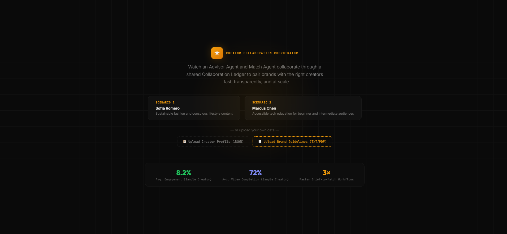 | 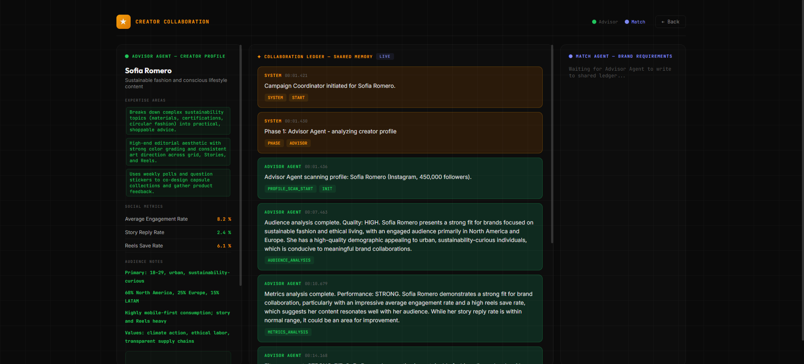 | 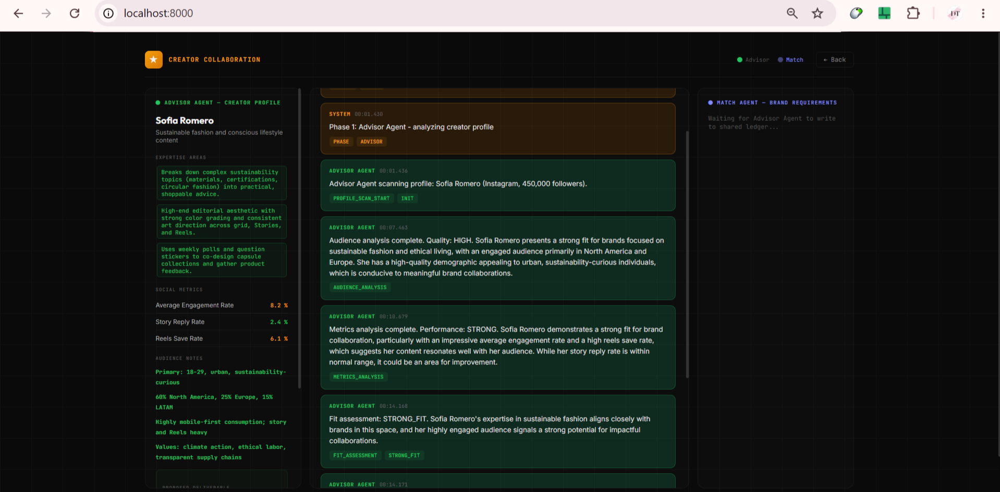 | 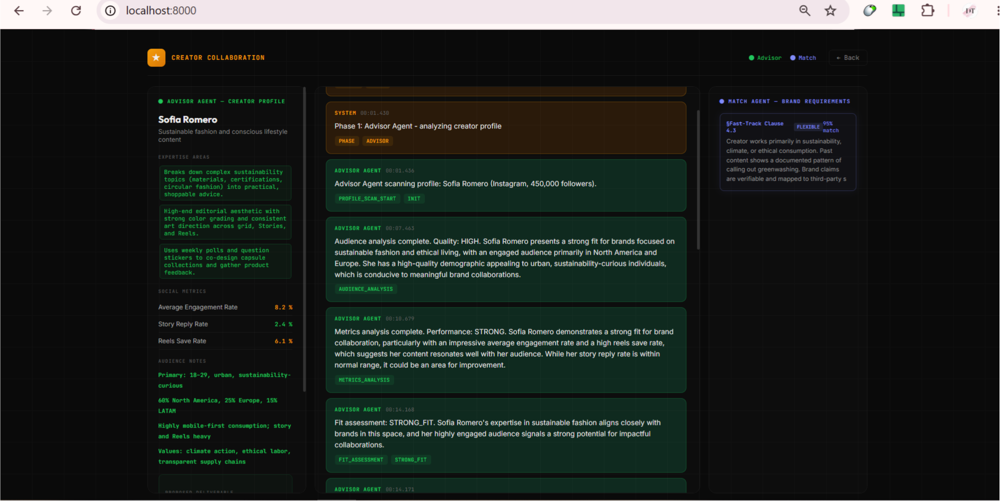 |
| Select scenario or upload custom data | Ledger populates in real-time via SSE | `STRONG_FIT` tagged within 14s | Match Agent reads shared state & reasons |

---

## ✨ Why This Project Stands Out

- 🧠 **Genuine multi-agent collaboration** — Advisor and Match Agents share a structured memory store, not opaque text blobs
- 📒 **Collaboration Ledger** — typed, timestamped, queryable shared state with event-driven subscribers
- 📡 **Live SSE streaming** — agent reasoning rendered in real time in the browser; no polling, no refresh
- 🔍 **Fully auditable decisions** — every match, conditional approval, or decline carries a structured rationale
- ⚡ **Production-inspired async orchestration** — `CampaignCoordinator` phases agents, handles retries, aggregates results
- 🔌 **Zero-retraining iteration** — update brand guidelines as a TXT/PDF; no model fine-tuning required

---

## 📊 Example Outcome

> **Creator:** Sofia Romero &nbsp;|&nbsp; **Brand:** Sustainable Fashion Co.

| Field | Value |
|---|---|
| **Result** | ✅ MATCHED |
| **Fit Score** | 91% |
| **Risk Flags** | 0 |
| **Pathway** | ⚡ FAST\_TRACK |
| **Reason** | Strong audience overlap (18–29, sustainability-curious), high engagement (8.2%), values alignment confirmed, no brand safety concerns found |

---

## 🚀 Quick Start

**Prerequisites:** Python 3.11+ · OpenAI API key

```bash
# Clone and enter project
cd creator-collab-coordinator

# Create and activate virtual environment
python -m venv venv
source venv/bin/activate          # macOS / Linux
venv\Scripts\activate             # Windows PowerShell

# Install and run
pip install -r requirements.txt
export OPENAI_API_KEY="sk-your-key-here"   # or $env: on Windows
python main.py
```

Open **`http://localhost:8000`**

---

## 🧠 Core Idea

Traditional influencer selection is opaque and hard to audit. This platform makes AI reasoning **legible**:

- Every agent decision is **structured, tagged, and timestamped** in the Collaboration Ledger
- The Match Agent **reads and adapts** to what the Advisor Agent wrote — not a summary, the actual typed state
- Every outcome ships with a **full audit trail**: cited guideline sections, risk flags, fit scores

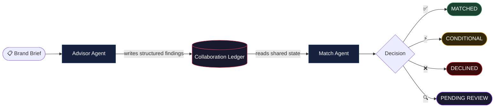

---

## 🎮 Demo Scenarios

The Match Agent reads the **same guidelines** for both creators — but reasons differently because the Advisor Agent writes different findings into the Ledger.

```mermaid
flowchart LR
    subgraph S1["🌿 Scenario 1 — Sofia Romero"]
        P1["Instagram · 450K followers\n8.2% engagement · Sustainable fashion"]
        T1["Tags: STRONG_FIT · fast-track-eligible"]
        B1["Best for: Eco brands, circular fashion,\nethical apparel launches"]
        P1 --> T1 --> B1
    end

    subgraph S2["💻 Scenario 2 — Marcus Chen"]
        P2["YouTube · 280K subscribers\n72% video completion · Tech education"]
        T2["Tags: EDUCATIONAL_FIT · brand-safety-verified"]
        B2["Best for: Dev tools, SaaS onboarding,\nproduct explainers"]
        P2 --> T2 --> B2
    end

    style S1 fill:#0a2d1a,stroke:#40916c
    style S2 fill:#0a1a2d,stroke:#0f3460
```

---

## 🏗️ System Architecture

### 🏛 Architecture at a Glance

```
Brand Brief
    ↓
Advisor Agent  —  analyzes creator profile, scores fit, surfaces risks
    ↓
Collaboration Ledger  —  thread-safe async shared memory (typed, queryable)
    ↓
Match Agent  —  reads ledger, maps to brand brief, cites guidelines
    ↓
Decision + Audit Trail  (MATCHED / CONDITIONAL / DECLINED / PENDING_REVIEW)
```

### Full Agent Collaboration Model

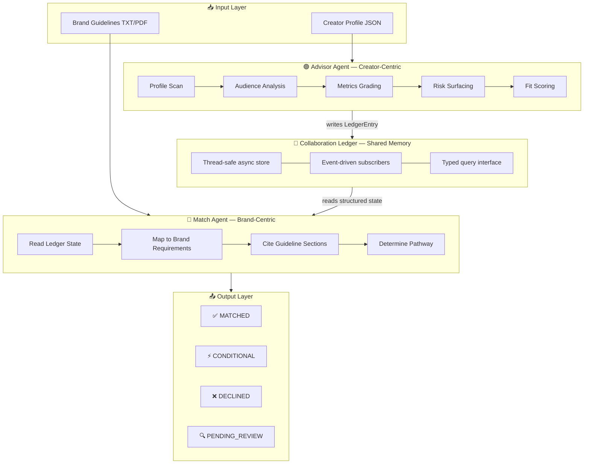

### SSE Streaming Pipeline

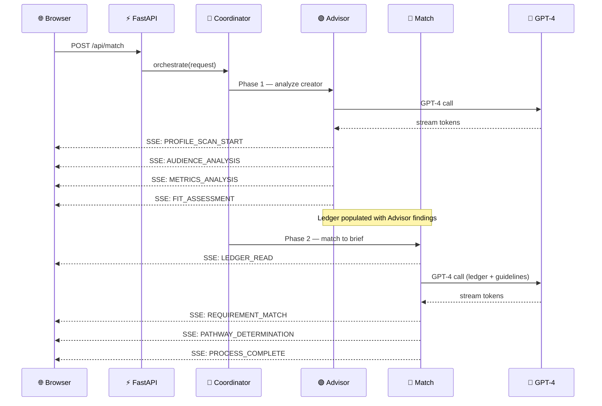

### Shared Ledger vs. Message Passing

```mermaid
flowchart LR
    subgraph NAIVE["❌ Naive Multi-Agent"]
        direction LR
        N1[Advisor] -->|"Sofia is good"| N2[Match]
        N2 --> N3[Result — no trail]
    end

    subgraph LEDGER["✅ Ledger-Based — This System"]
        direction LR
        L1[Advisor] -->|"LedgerEntry { event_type, tags,\nfit_score, risk_flags }"| L2[(Ledger)]
        L2 -->|typed query| L3[Match]
        L3 --> L4[Result + Full Audit Trail]
    end

    style NAIVE fill:#2d0a0a,stroke:#e63946
    style LEDGER fill:#0a2d1a,stroke:#40916c
```

---

## ⚡ Architectural Tradeoffs

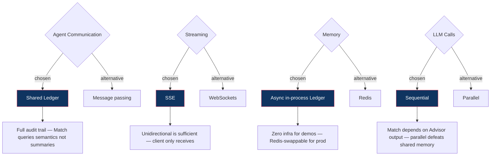

### Known Limitations

| Limitation | Suggested Fix |
|---|---|
| In-process ledger doesn't scale across workers | Swap for Redis Streams |
| No persistent storage | Add Postgres for historical analytics |
| Single-turn LLM calls | Multi-turn for better edge-case handling |
| No creator consent/privacy layer | Required before production use |
| OpenAI-only | Provider-agnostic via LiteLLM |

---

## 💡 Technical Highlights

**1. True Shared Memory**
```python
class CollaborationLedger:
    async def write(self, entry: LedgerEntry):
        async with self._lock:
            self._entries.append(entry)
            await self._notify_subscribers(entry)   # event-driven

    async def query(self, event_type=None, tags=None):
        return [e for e in self._entries if matches(e, event_type, tags)]
```

**2. Structured Agent Reasoning**
```python
await ledger.write(LedgerEntry(
    source="advisor",
    event_type="FIT_ASSESSMENT",
    tags=["STRONG_FIT", "sustainability", "fast-track-eligible"],
    severity="high",
    data={"fit_score": 0.91, "risk_flags": [], "fast_track_eligible": True}
))
```

**3. Match Agent Adapts to Ledger State**
```python
fit_entries = await ledger.query(event_type="FIT_ASSESSMENT")
if fit_entries[0].data.get("fast_track_eligible"):
    # → PATHWAY: FAST_TRACK
else:
    # → PATHWAY: PENDING_REVIEW with flagged concerns
```

---

## 🔧 API Reference

### Endpoints

| Method | Endpoint | Description |
|---|---|---|
| `GET` | `/api/campaigns` | List demo scenarios |
| `GET` | `/api/scenario/{id}` | Creator profile + guidelines |
| `POST` | `/api/match` | **Run agents** — SSE stream |
| `GET` | `/` | Frontend |

### SSE Event Flow


Each event is a typed `LedgerEntry`:

```typescript
interface LedgerEntry {
  source:     "advisor" | "match" | "ledger" | "system"
  event_type: string
  message:    string                  // human-readable
  data:       Record<string, any>     // structured payload
  timestamp:  number
  severity?:  "low" | "medium" | "high"
  tags?:      string[]
}
```

> 📄 Full API examples and custom payload schema → [`docs/API.md`](docs/API.md)

---

## 📁 Project Structure

```
creator-collab-coordinator/
├── main.py                       # FastAPI server + SSE streaming
├── agents/
│   ├── advisor_agent.py          # Creator-centric analysis → writes to Ledger
│   ├── match_agent.py            # Brand-centric matching → reads from Ledger
│   └── coordinator.py            # CampaignCoordinator orchestration
├── memory/
│   └── ledger.py                 # CollaborationLedger — shared async memory
├── models/
│   └── schemas.py                # Pydantic: CreatorProfile, LedgerEntry, etc.
├── data/
│   ├── creator_profile_fashion_influencer.json
│   ├── creator_profile_tech_educator.json
│   └── collaboration_guidelines.txt
├── static/
│   └── index.html                # Frontend — no build step
├── assets/                       # Screenshots + demo video
└── docs/
    └── API.md                    # Full API reference + custom payload examples
```

---

## 🛠️ Stack

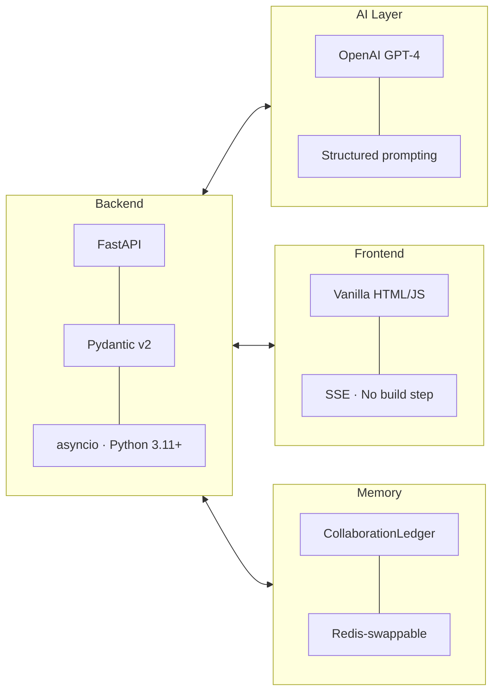

---

## 🏭 Built For

| Persona | Use Case |
|---|---|
| **Brand Partnership Teams** | Upload brief → get a structured match decision with cited rationale in minutes |
| **Creator Agencies** | Run your roster against multiple briefs; ledger becomes an exportable audit document |
| **AI/ML Engineers** | Reference implementation of structured multi-agent collaboration via shared state |
| **Hackathon Judges** | End-to-end demo with real agent reasoning, live streaming, and explainable outcomes |

---

<div align="center">

**Built for teams who want AI to *explain* its decisions — not just generate another list of names.**

<br/>

*Made with ⭐ and structured shared memory*

</div>